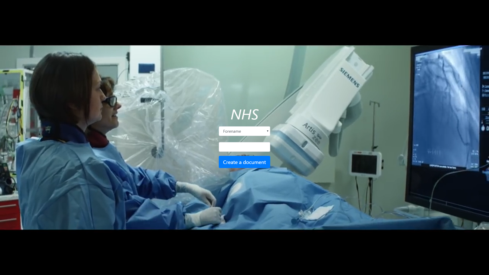

# Patient Health Records Generator (GOSH-FHIR-Word2020)

The challenge of this project was to use synthetically generated data retrieved over FHIR from a GOSH gateway to generate documents prefilled with records. I developed a web application in Flask which uses a Python API for creating and updating Microsoft Word. I also used FHIR Parser which made it easier for me to access the information that I needed from HL7 FHIR. The user can find any patient by using their unique identifier, forename and surname. When the user presses 'Create a document' the file will appear in the folder FHIR. You can use the files(Forename.txt, Surname.txt and Unique_identifier.txt) provided in the example folder to test the web application.

## Getting Started

These instructions will get you a copy of the project up and running on your local machine for development and testing purposes.

### Prerequisites

* [Deployment Guide Regarding .NET Core 2.1](https://github.com/goshdrive/FHIRworks_2020)
* Create a [virtual environment](https://docs.python.org/3/library/venv.html) in the same folder as the requirements.txt file and activate the environment. The virtual environment is desirable, but not essential to run this web application.
* Install all the required packages from requirements.txt on the terminal or command line using
```
pip install -r requirements.txt
```

### Deployment

* Run the project by clicking run on the Flask.py or using the command in terminal/command line
```
python Flask.py
```
* Click on the link provided to access the web application
```
http://127.0.0.1:677/
```
* That's all. Enjoy!

## Built With

* [Flask](https://flask.palletsprojects.com/en/1.1.x/quickstart/) - The web framework used
* [FHIR-Parser](https://fhir-parser.readthedocs.io/en/latest/) - FHIR library for Python
* [Docx](https://python-docx.readthedocs.io/en/latest/) - Python library for creating and updating Microsoft Word (.docx) files
* [Bootstrap](https://getbootstrap.com/) - Open source toolkit for developing with HTML, CSS, and JS

## Acknowledgments

* [Icon](https://commons.wikimedia.org/wiki/File:NHS-Logo.svg) used for the generated documents
* [Video](https://www.youtube.com/watch?v=GVBP1ld0_n0) used for the background of the web application

## Authors

* **[Sabina-Maria Mitroi](https://github.com/MitroiSabina)** - *Initial work*

## Sneak Peak


